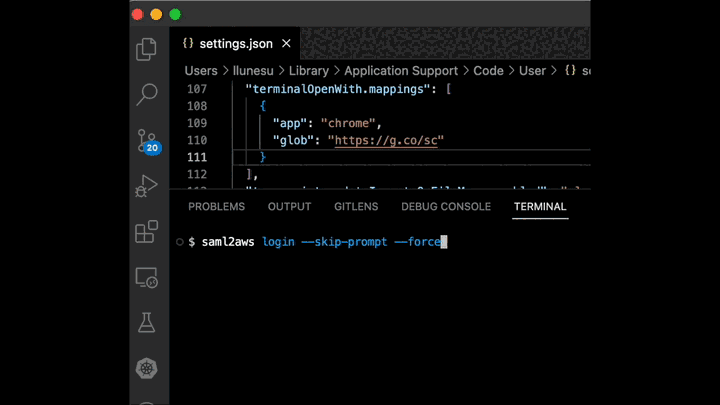

# terminal-open-with 

This extension allows you to open links in the terminal with a specific app or browser, depending on the URL. For example, I use it to always open Google's auth site with Chrome:

## Install

Install from the [Visual Studio Marketplace](https://marketplace.visualstudio.com/items?itemName=lionello.terminal-open-with).

## Extension Settings

This extension contributes the following settings:

* `terminalOpenWith.mappings`: An array of mappings:
    * Simple url-app mapping: `{ "glob": "https://g.co/sc", "app": "chrome" }`
    * Or with wildcards and arguments: `{ "glob": "http://localhost**", "app": "firefox", "args": ["-private"] }`

A glob can use any of the following wildcards:

* `?`: any filename character (excludes directory separators `/` and `\`)
* `*`: zero or more filename characters (excludes directory separators `/` and `\`)
* `**` "globstar": zero or more path characters (*includes* directory separators)

## Known Issues

* Currently only supports `chrome`, `edge`, `firefox`, `code`, or `default`.

## Publishing

* Create a Personal Access Token with Marketplace:Manage scope on dev.azure.com
* Run `vsce login lionello` followed by `vsce publish minor`

## Release Notes

### 0.1.2

Updated NPM dependencies.

### 0.1.1

First release (no changes.)

### 0.0.2

Added extension icon: External Link by Colourcreatype from <a href="https://thenounproject.com/browse/icons/term/external-link/" target="_blank" title="External Link Icons">Noun Project</a>

### 0.0.1

Initial pre-release of `terminal-open-with`.
